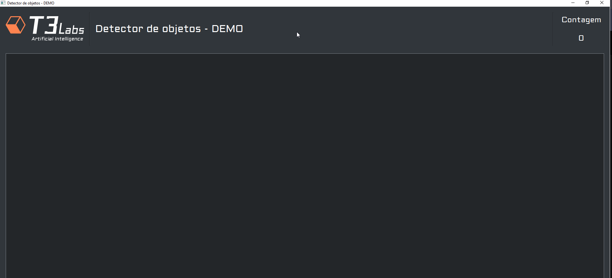

# Aplicação Base de Visão Computacional

Esse é um projeto base para servir para qualquer pessoa que precise fazer um sistema de detecção
com [YOLO ( Darknet ) ](https://pjreddie.com/darknet/yolo/) e um Tracker com Kalman.

## Para configurar o uso

Há um arquivo chamado ``.env.sample`` em que para que seja utilizável você pode criar um novo chamado ``.env``

Os parâmetros são

````
INPUT=0
WEIGHTS_PATH=./settings/yolov3-tiny.weights
CFG_PATH=./settings/yolov3-tiny.cfg
LABELS_PATH=./settings/coco.names

````

INPUT é o parametro de entrada de vídeo, pode ser uma webcam ou câmera de rede;

WEIGHTS_PATH é o caminho dos pesos do modelo [YOLO](https://pjreddie.com/darknet/yolo/) da Darknet;

CFG_PATH é o caminho onde contem o arquivo de configuração da [YOLO](https://pjreddie.com/darknet/yolo/);

LABELS_PATH é o caminho que contem os labels do modelo [YOLO](https://pjreddie.com/darknet/yolo/).

## Para executar a aplicação

<br>

````
python application.py
````

<br>


Para executar no Docker

```
docker build --rm -t "name:latest" .
docker run -it -e DISPLAY=$DISPLAY -v /tmp/.X11-unix:/tmp/.X11-unix --name name name
```

<br>




## Arquitetura do Projeto

O projeto é baseado na
arquitetura [MVC ( Model, View , Controller)](https://www.codeguru.com/dotnet/exploring-the-mvc-mvp-and-mvvm-design-patterns/)

## Bibliotecas usadas

O que usamos para criar esse projeto base é a lib [PyQT/Pyside2](https://riverbankcomputing.com/software/pyqt/) que é um
excelente framework para lidar com concorrência e memória sendo excelente para aplicações de visão computacional

## Para alterar

Antes de alterar o código, busque entender o funcionamento dele, ficará mais simples a vida.

O que recomendamos, olhe os models e as views, é onde você manipula e mostra a informação.

Esse projeto usa [YOLO](https://pjreddie.com/darknet/yolo/) para fazer a inferência, recomendamos usar a versão
de [Alexey Bochkovskiy](https://github.com/AlexeyAB/darknet)


